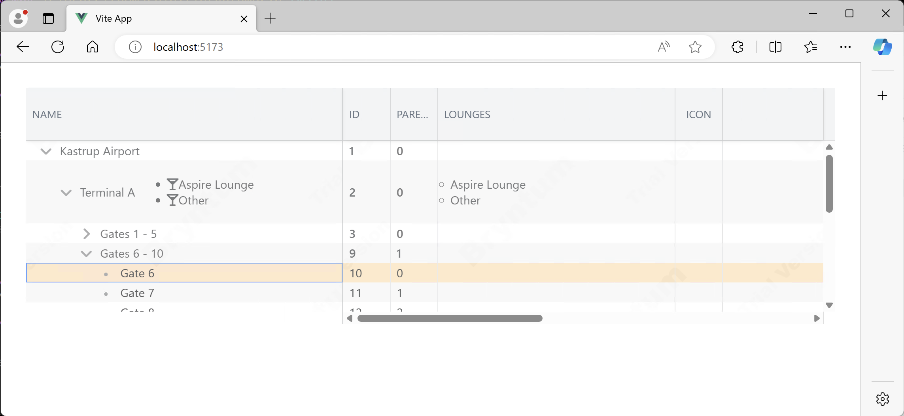
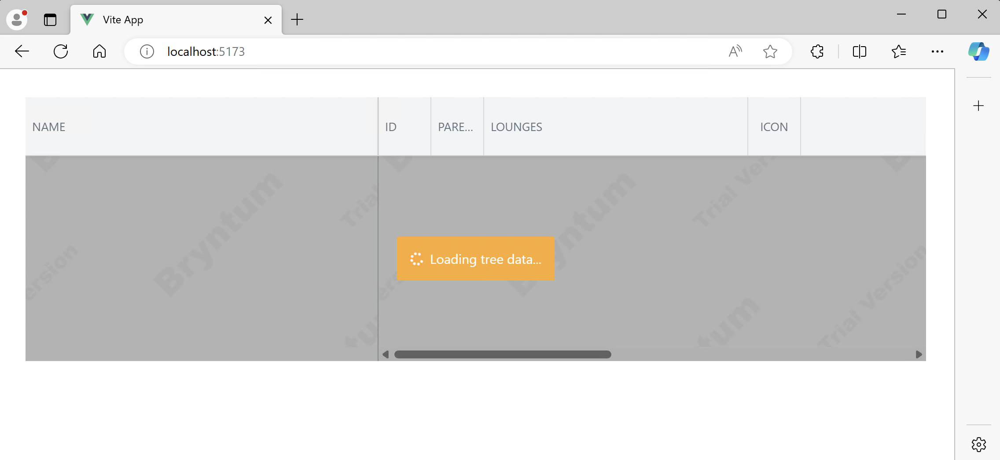

# bryntumlazyload

Bryntum Lazy Load Demo.<br>
Based on the default Vue 3 with Vite template which is used when created through IntelliJ (Pro) -> File -> New -> Project -> Vue.js

(Original template available in branch 'demotemplate')

Bryntum Tree Grid sample adopted for Vue.js from

https://bryntum.com/products/grid/examples/frameworks/react-vite/tree/dist/


## Install demo

```sh
git clone https://github.com/ekert-it/bryntumgrid.git

npm login --auth-type=legacy --registry=https://npm.bryntum.com

cd bryntumgrid/

npm install

npm run dev
```


## Reproduce steps for lazyLoad hang:

Uncomment `lazyLoad: true,` in file `src/config/ViewDataConfigAirport.js`.
```js
const store = new AjaxStore({
    modelClass : Gate,
    readUrl    : '/data/airport.json',
    autoLoad   : true,
    tree       : true,
    lazyLoad: true,
});
```

